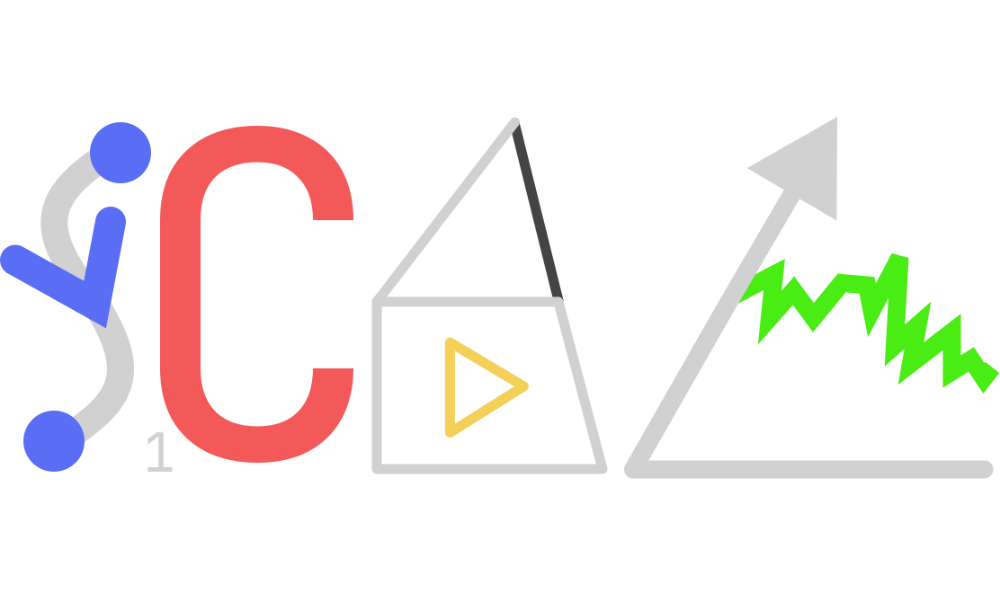

### Easy animation system focused on code.   
 
# Read [Rust Docs](https://docs.rs/scal-core/latest/scal_core/)

# Testing
After Implementing Any New Features Just use:
`cargo test --workspace`
After any bigger changes, visual inspection of all examples might be needed to prevent regression. 

# Package Update Procedure 
0. cargo test + visually inspect all examples if they look right. 
1. update workspace version
2. update scal_core version
3. update flake.nix version
4. create a new git version branch
5. acargo publish on: core, runtime, ipc
